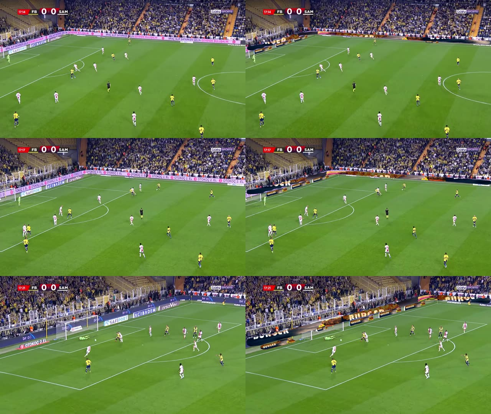

<p align="center">
  
</p>

# AdSwapAI

<p align="center">
  <a href="LICENSE"></a>
  
  
  
  
  
</p>

**AI-based replacement of pitch-side advertising boards in sports video
(virtual advertising / ad insertion without camera-tracking hardware).**
Upload a clip, pick an ad, get the same clip back with every board carrying
the new ad, players and ball untouched. A segmentation model finds the
boards in every frame and a second model protects the people in front of
them. Built with PyTorch, Detectron2 Mask R-CNN, OpenCV, Flask, nginx and
Docker; the next iteration uses Meta's SAM3 for prompt-based detection.

<p align="center">
  <br>
  <sub>Left: the original broadcast clip. Right: AdSwapAI output (Sep 2026 build), same three moments. The far LED strip and the near boards carry the new ad; the players stay in front.</sub>
</p>

This repository is the whole story of the project, from the first CUDA smoke
test in January 2025 to the Docker-packaged web application that runs today,
organised so that the progression can be followed step by step. The private
R&D archive held around 400 experiment files; the ones kept here are the ones
that worked and that explain how the next step came about.

## Status

* **Working**: `app/` processes 1080p football footage at about 6 fps on an
  RTX 5070 Ti (two Mask R-CNN passes per frame), served through a web UI.
  Verified end to end on 2 Sep 2026.
* **Model**: custom Detectron2 Mask R-CNN (R50-FPN) trained on ~150
  hand-labelled frames from three matches. It is good on those matches and
  generalises modestly; new footage needs more labelled data.
* **Not done**: live/stream mode, a model trained at scale, curved LED strips.
* The company behind it (Altervision, later AdSwap AI) looked for investment
  in mid-2025 and did not find it; the code was shelved until this clean-up.

## Repository layout

```
adswapai/
├── app/            the current application: Flask + Detectron2 backend, nginx frontend, Docker Compose
├── experiments/    the R&D history, one chapter per phase, each with its own README
│   ├── 01_pretrained_detectors_jan2025/   pretrained Faster/Mask R-CNN in Docker, click-to-detect, MJPEG stream
│   ├── 02_cars_to_adboards_mar2025/       car tracking, car removal by inpainting, first ad replaced by hand-drawn polygon
│   ├── 03_polygon_tracking_apr2025/       LK / SIFT / CSRT / SuperGlue trackers, custom YOLOv8-seg model, Kalman tracker
│   ├── 04_maskrcnn_replacement_apr2025/   Detectron2 Mask R-CNN inference, RAFT optical flow, mask-based replacement
│   ├── 05_web_app_may2025/                the Flask web app as it was when the investor search started
│   ├── 06_sam2_baseline_aug2025/          last experiment before the shelf: SAM2 video tracking baseline
│   └── 07_sam3_sep2026/                   active: SAM3 text-prompted detection and tracking probes
├── training/       datasets (YOLO v1, VIA v3, COCO json) and the training scripts
├── docs/           journey write-up, asset list, before/after frames, concept art, business documents
└── .gitignore      model weights, videos and datasets with images stay out of git (see docs/assets.md)
```

## Quick start

```bash
git clone <this repo> && cd adswapai/app
# put model_final.pth into backend/ and the sample clips into frontend/static/sampleVideos/ (docs/assets.md)
docker compose up -d --build      # first build 15-40 min: torch 2.7 + CUDA 12.8 + Detectron2
```

Open http://localhost, choose a sample clip and an ad, press **Process**.
Details, API, CLI and limitations: [`app/README.md`](app/README.md).

## How a frame is processed

1. The custom Mask R-CNN returns an instance mask per advertising board.
2. A stock COCO Mask R-CNN returns masks for people and the ball; they are
   subtracted from every board mask.
3. A small IoU tracker keeps a board alive for a few frames when detection
   drops out, which removes most flicker.
4. Boards wider than 60 % of the frame (the perimeter LED strip) get the ad
   repeated horizontally; the others get a single perspective-warped ad.
   Corners come from the minimum-area rectangle snapped to the mask's convex
   hull; edges are feathered.
5. Frames stream into ffmpeg (H.264, faststart); the original audio is kept.

## The journey

| Chapter | When | What happened | Result |
|---------|------|---------------|--------|
| [01 Pretrained detectors](experiments/01_pretrained_detectors_jan2025/) | 17 Jan – 1 Feb 2025 | CUDA check, Faster R-CNN then Mask R-CNN behind a Flask/nginx UI, click-to-detect on stills, then on video frames, then a server-side MJPEG pipeline. | The per-frame server pipeline everything else builds on. |
| [02 Cars to ad boards](experiments/02_cars_to_adboards_mar2025/) | 1 – 17 Mar 2025 | Car tracking GUI, MOG2 masking, car removal by Mask R-CNN + inpainting, then the pivot to ad boards: heuristics fail, boards drawn by hand as polygons, SIFT homography tracking, people cut out. | **First ad replaced in a football clip** (17 Mar). |
| [03 Polygon tracking](experiments/03_polygon_tracking_apr2025/) | 1 – 17 Apr 2025 | Lucas-Kanade vs SIFT vs CSRT vs SuperGlue on user polygons; first custom **YOLOv8-seg billboard model**; automatic replacement from segmentation polygons; IoU/Kalman "known ads" tracker. | Manual initialisation gone; jitter identified as the next problem. |
| [04 Mask R-CNN replacement](experiments/04_maskrcnn_replacement_apr2025/) | 18 Apr – 8 May 2025 | Dataset relabelled with VIA polygons, **Detectron2 Mask R-CNN** trained (the model still in use), perspective paste, two-stage detect/render pipeline, DeepSORT-style and RAFT optical-flow tracking with people/ball subtraction, then a deliberate rollback to per-frame replacement. | The detection quality that made a demo possible; the 150-line per-frame replacer became the app's core. |
| [05 Web application](experiments/05_web_app_may2025/) | 8 May – 5 Jun 2025 | Flask API + nginx site, job queue, admin page, perspective paste, smart tiling for wide boards, Altervision → AdSwap AI rebrand, landing page with before/after slider. | Public demo used for the investor search. |
| [06 SAM2 baseline](experiments/06_sam2_baseline_aug2025/) | 25 Aug 2025 | Segment Anything 2 video predictor prompted with grid points, as a baseline for prompt-based tracking. | Last experiment before the project was shelved. |
| [Current app](app/) | 2 Sep 2026 | Clean-up of the May 2025 app: pipeline separated from Flask, single GPU worker queue, temporal smoothing, feathered edges, aspect-correct tiling, robust corner selection, one-pass ffmpeg encoding with audio, every API route proxied. | Verified on all sample clips; this is the code to continue from. |
| [07 SAM3](experiments/07_sam3_sep2026/) | 2 Sep 2026 → | **Active.** Meta's SAM3 with text prompts finds every board (far LED strips included) with no training data: "sponsor banner" / "advertisement" beat "billboard". Three tracking approaches measured on the same frames (SAM3 video predictor, SAM 3.1 multiplex, hybrid detect + associate). | Detection solved without a dataset; tracker choice and board-space replacement are next. |

The long-form write-up with what was tried, what failed and why is in
[`docs/journey.md`](docs/journey.md).

## Training data and models

* `training/dataset_v1`: Roboflow export, YOLO-seg format, 1 class `billboard`, 21 images (in git).
* `training/dataset_v3`: VIA polygon annotations for 153 frames (csv + converter, in git; images in the archive).
* `training/detectron2`: COCO json used for the Mask R-CNN training (in git) and the training script.
* Weights (`model_final.pth` 351 MB, `best.pt` 24 MB) and every video are outside git: [`docs/assets.md`](docs/assets.md).

## Business context

`docs/business/` holds the pitch, the business plan and the POC step list
written in spring 2025 (Word files). `docs/images/concepts/` has the concept
art produced for the brand. The pitch aimed at broadcasters and OTT platforms:
offline ad replacement first, live replacement second, arbitrary object
replacement third.

## What comes next (in progress, Sep 2026)

<p align="center">
  <br>
  <sub>SAM3, prompt "sponsor banner", no training: every board found in all three clips at four moments each.</sub>
</p>

1. **Detect once, track in between.** SAM3 finds the boards on the first
   frame and after events (shot cuts, new boards); a tracker follows them
   instead of re-detecting every frame. Candidates measured in
   `experiments/07_sam3_sep2026`: SAM3 video predictor (stable, 0.24 fps),
   SAM 3.1 multiplex (fast prompts, propagation not yet stable on 16 GB),
   hybrid detect + IoU association (3.4 fps).
2. **Board-space rendering.** Each board gets a persistent reference
   quadrilateral; the ad is mapped in board coordinates, so a half-visible
   board shows half an ad and the ad stops sliding during pans. Needs a
   camera-motion homography, which also carries boards through occlusion.
3. **Soft occluders.** People and ball as alpha mattes instead of binary
   masks, motion blur and colour matched to the board.
4. **GPU pipeline.** torch-based warping and compositing, fp16, GPU decode
   and encode; target real-time 1080p.
5. Later: a real dataset (the business plan's 3 M frames) if a trained
   detector is still needed, and a real-time broadcast path.

## License

[MIT](LICENSE). The sample footage, the ad images and the brand assets in
`docs/images/brand/` are not covered by the license; the third-party models
and libraries used (Detectron2, torchvision, Ultralytics, SAM2, RAFT,
SuperGlue) keep their own licenses.
