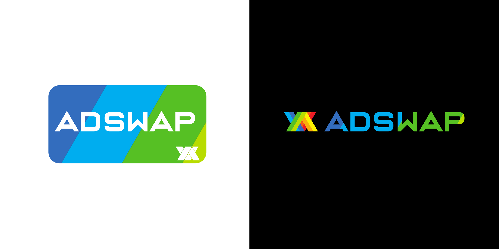
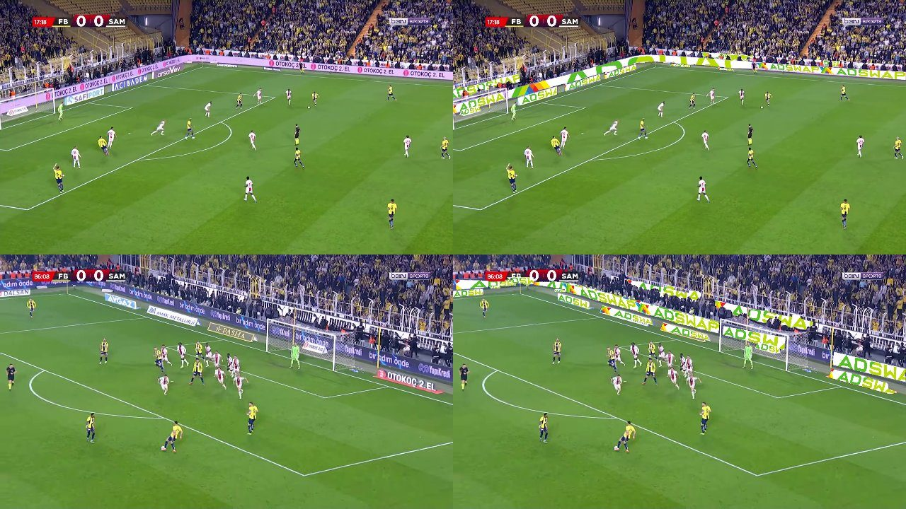
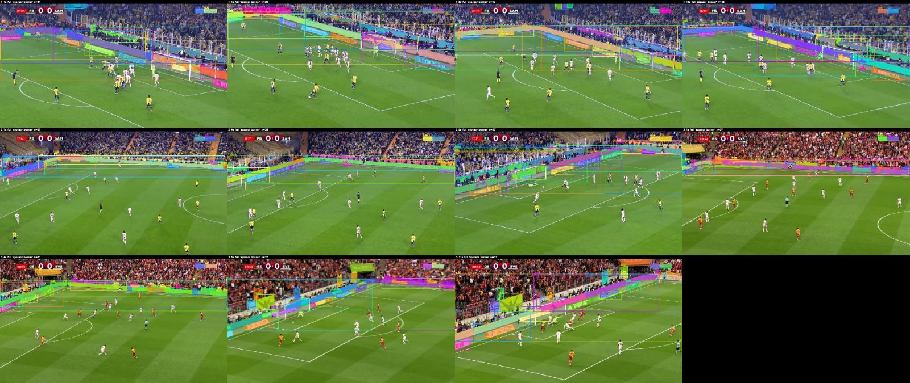

<p align="center">
  
</p>

# AdSwapAI

<p align="center">
  <a href="LICENSE"></a>
  
  
  
  
  
</p>

**AI-based replacement of pitch-side advertising boards in sports video
(virtual advertising / ad insertion without camera-tracking hardware).**
Give it a clip and an ad, get the same clip back with every board carrying
the new ad, players and ball untouched. Meta's SAM3 finds the boards from a
text prompt with no training data, a camera-motion model carries them between
detections, and the ad is composited on the GPU: 23-26 fps at 1080p on one
RTX 5070 Ti. Built with PyTorch, SAM3, RAFT, torchao (fp8), OpenCV and
ffmpeg/NVENC. The 2025 generation, a Detectron2 Mask R-CNN app in Docker, is
kept in `app/` and still runs.

<p align="center">
  <br>
  <sub>Left: the original broadcast clips. Right: AdSwapAI output (SAM3 pipeline, 3 Sep 2026). Every board carries the new ad, the far LED strips included; the players and the goal net stay in front.</sub>
</p>

This repository is the whole story of the project, from the first CUDA smoke
test in January 2025 to the Docker-packaged web application that runs today,
organised so that the progression can be followed step by step. The private
R&D archive held around 400 experiment files; the ones kept here are the ones
that worked and that explain how the next step came about.

## Status

* **Current pipeline** (`experiments/07_sam3_sep2026/`, 3 Sep 2026): SAM3
  text-prompted detection, no training data; SAM3 runs on every 5th frame and
  a homography from RAFT optical flow moves the boards in between; everything
  after decoding runs on the GPU (fp8 backbone with torchao, transformers and
  RAFT under CUDA graphs, GPU compositing, NVENC encoding). All three sample
  clips replaced end to end at 23-26 fps, audio kept. Plain scripts, no web
  UI yet.
* **Previous generation** (`app/`, 2025, cleaned up 2 Sep 2026): Flask +
  Detectron2 Mask R-CNN in Docker with a web UI, about 6 fps at 1080p on the
  same card, two Mask R-CNN passes per frame. Its custom model was trained on
  ~150 hand-labelled frames from three matches and generalises modestly; that
  is what SAM3 removes.
* **Not done**: SAM3 pipeline in the web app, live/stream mode, curved LED
  strips, lighting and colour matching of the ad.
* The company behind it (Altervision, later AdSwap AI) looked for investment
  in mid-2025 and did not find it; the code was shelved until this clean-up.

## Repository layout

```
adswapai/
├── app/            the 2025 application (previous generation, still runs): Flask + Detectron2 backend, nginx, Docker Compose
├── experiments/    the R&D history, one chapter per phase, each with its own README
│   ├── 01_pretrained_detectors_jan2025/   pretrained Faster/Mask R-CNN in Docker, click-to-detect, MJPEG stream
│   ├── 02_cars_to_adboards_mar2025/       car tracking, car removal by inpainting, first ad replaced by hand-drawn polygon
│   ├── 03_polygon_tracking_apr2025/       LK / SIFT / CSRT / SuperGlue trackers, custom YOLOv8-seg model, Kalman tracker
│   ├── 04_maskrcnn_replacement_apr2025/   Detectron2 Mask R-CNN inference, RAFT optical flow, mask-based replacement
│   ├── 05_web_app_may2025/                the Flask web app as it was when the investor search started
│   ├── 06_sam2_baseline_aug2025/          last experiment before the shelf: SAM2 video tracking baseline
│   └── 07_sam3_sep2026/                   active: SAM3 detection, camera-motion tracking, GPU replacement pipeline
├── training/       datasets (YOLO v1, VIA v3, COCO json) and the training scripts
├── docs/           journey write-up, asset list, before/after frames, concept art, business documents
└── .gitignore      model weights, videos and datasets with images stay out of git (see docs/assets.md)
```

## Quick start

**SAM3 pipeline** (Windows or Linux, one NVIDIA GPU with 16 GB, ffmpeg with
NVENC on PATH):

```bash
git clone <this repo> && cd adswapai/experiments/07_sam3_sep2026
# venv with torch (CUDA 12.8), sam3, torchao and the SAM3 checkpoint: see the chapter README, section 1
# put the sample clips into data/ (docs/assets.md)
python sam3_replace.py            # settings at the top of the file: clip, ad image, detection interval
```

The output video, a stats JSON (fps, time per stage) and a contact sheet of
original | replaced pairs land in `output/replace/`. `sam3_hybrid_track.py`
writes the diagnostic version with coloured masks and track ids.

**2025 app** (Docker, web UI, Detectron2):

```bash
cd adswapai/app
# put model_final.pth into backend/ and the sample clips into frontend/static/sampleVideos/ (docs/assets.md)
docker compose up -d --build      # first build 15-40 min: torch 2.7 + CUDA 12.8 + Detectron2
```

Open http://localhost, choose a sample clip and an ad, press **Process**.
Details, API, CLI and limitations: [`app/README.md`](app/README.md).

## How a frame is processed (SAM3 pipeline)

1. **Detection**, every 5th frame and on shot cuts: SAM3 with the text prompt
   "sponsor banner" returns a mask and a score per board. Overlapping
   duplicates and HUD graphics are dropped; the work is done on the decoder's
   low-resolution masks with one matmul.
2. **Camera motion**, every frame: RAFT-small optical flow at quarter
   resolution, a homography fitted to it with RANSAC.
3. **Tracking**: every board's mask, box and quadrilateral are moved with
   that homography; on detection frames the moved masks are matched to the
   new detections by IoU, so ids survive pans and brief drop-outs.
4. **Replacement**: a quadrilateral per board (minimum-area rectangle, long
   edges as top and bottom, corners snapped to the convex hull), fitted once
   per detection; the ad is mapped into it on the GPU, repeated with its
   aspect ratio on wide strips, centre-cropped on narrow boards, and painted
   inside the mask with a feathered edge. Players in front of a board are not
   in SAM3's mask, so they stay in front of the ad.
5. **Encoding**: frames go to ffmpeg on a writer thread, H.264 on NVENC, the
   original audio copied.

The GPU work behind it, with the measurements that led to each choice, is in
the [chapter README](experiments/07_sam3_sep2026/README.md). The 2025 app's
pipeline (Detectron2 + a COCO person model) is described in
[`app/README.md`](app/README.md).

## The journey

| Chapter | When | What happened | Result |
|---------|------|---------------|--------|
| [01 Pretrained detectors](experiments/01_pretrained_detectors_jan2025/) | 17 Jan – 1 Feb 2025 | CUDA check, Faster R-CNN then Mask R-CNN behind a Flask/nginx UI, click-to-detect on stills, then on video frames, then a server-side MJPEG pipeline. | The per-frame server pipeline everything else builds on. |
| [02 Cars to ad boards](experiments/02_cars_to_adboards_mar2025/) | 1 – 17 Mar 2025 | Car tracking GUI, MOG2 masking, car removal by Mask R-CNN + inpainting, then the pivot to ad boards: heuristics fail, boards drawn by hand as polygons, SIFT homography tracking, people cut out. | **First ad replaced in a football clip** (17 Mar). |
| [03 Polygon tracking](experiments/03_polygon_tracking_apr2025/) | 1 – 17 Apr 2025 | Lucas-Kanade vs SIFT vs CSRT vs SuperGlue on user polygons; first custom **YOLOv8-seg billboard model**; automatic replacement from segmentation polygons; IoU/Kalman "known ads" tracker. | Manual initialisation gone; jitter identified as the next problem. |
| [04 Mask R-CNN replacement](experiments/04_maskrcnn_replacement_apr2025/) | 18 Apr – 8 May 2025 | Dataset relabelled with VIA polygons, **Detectron2 Mask R-CNN** trained (the model still in use), perspective paste, two-stage detect/render pipeline, DeepSORT-style and RAFT optical-flow tracking with people/ball subtraction, then a deliberate rollback to per-frame replacement. | The detection quality that made a demo possible; the 150-line per-frame replacer became the app's core. |
| [05 Web application](experiments/05_web_app_may2025/) | 8 May – 5 Jun 2025 | Flask API + nginx site, job queue, admin page, perspective paste, smart tiling for wide boards, Altervision → AdSwap AI rebrand, landing page with before/after slider. | Public demo used for the investor search. |
| [06 SAM2 baseline](experiments/06_sam2_baseline_aug2025/) | 25 Aug 2025 | Segment Anything 2 video predictor prompted with grid points, as a baseline for prompt-based tracking. | Last experiment before the project was shelved. |
| [2025 app](app/) | 2 Sep 2026 | Clean-up of the May 2025 app: pipeline separated from Flask, single GPU worker queue, temporal smoothing, feathered edges, aspect-correct tiling, robust corner selection, one-pass ffmpeg encoding with audio, every API route proxied. | Verified on all sample clips; the previous generation, kept runnable. |
| [07 SAM3](experiments/07_sam3_sep2026/) | 2 Sep 2026 → | **Active.** Meta's SAM3 with text prompts finds every board (far LED strips included) with no training data: "sponsor banner" / "advertisement" beat "billboard". Three tracking approaches measured on the same frames (SAM3 video predictor, SAM 3.1 multiplex, hybrid detect + associate). 3 Sep: the hybrid tracker rebuilt as a GPU pipeline (3.3 → 11 fps: post-processing on the GPU, bf16 then fp8 backbone with torchao, transformer + RAFT under CUDA graphs, NVENC), detection every 5th frame with RAFT-homography propagation in between (33 fps tracking), and a first board-space ad replacement. | Detection solved without a dataset; all three clips replaced end to end at 23-26 fps. |

The long-form write-up with what was tried, what failed and why is in
[`docs/journey.md`](docs/journey.md).

## Training data and models

* `training/dataset_v1`: Roboflow export, YOLO-seg format, 1 class `billboard`, 21 images (in git).
* `training/dataset_v3`: VIA polygon annotations for 153 frames (csv + converter, in git; images in the archive).
* `training/detectron2`: COCO json used for the Mask R-CNN training (in git) and the training script.
* Weights (`model_final.pth` 351 MB, `best.pt` 24 MB) and every video are outside git: [`docs/assets.md`](docs/assets.md).

## Business context

`docs/business/` holds the pitch, the business plan and the POC step list
written in spring 2025 (Word files). `docs/images/concepts/` has the concept
art produced for the brand. The pitch aimed at broadcasters and OTT platforms:
offline ad replacement first, live replacement second, arbitrary object
replacement third.

## What comes next (in progress, Sep 2026)

<p align="center">
  <br>
  <sub>SAM3, prompt "sponsor banner", no training: every board found in all three clips at four moments each.</sub>
</p>

<p align="center">
  <br>
  <sub>3 Sep 2026, <code>sam3_replace.py</code>: original (left) and output (right) for clip 2 and clip 1. SAM3 every 5th frame, RAFT-homography propagation in between, ad mapped per board on the GPU; 23-26 fps at 1080p on an RTX 5070 Ti.</sub>
</p>

1. **Detect once, track in between.** Done in its first form: SAM3 on every
   5th frame (and on shot cuts), tracks moved with a camera homography from
   RAFT optical flow in between. 33 fps tracking on clip 2 with fewer id
   switches than detecting every frame. Measured alternatives: SAM3 video
   predictor (0.24 fps), SAM 3.1 multiplex (propagation not stable on 16 GB).
2. **Board-space rendering.** First version done: a quadrilateral per board,
   fitted once per detection and carried by the homography, the ad mapped
   into it on the GPU (tiled on wide strips). Still to do: merge boards found
   as separate sponsor panels, keep the ad anchored to the board across
   partial visibility, colour and lighting match.
3. **Soft occluders.** People and ball as alpha mattes instead of binary
   masks, motion blur; on propagated frames the occluder hole still moves
   with the camera, not with the player.
4. **GPU pipeline.** Done for the experiment: bf16 / fp8 backbone (torchao),
   transformer and RAFT under CUDA graphs, GPU compositing, NVENC encoding,
   decode and encode on worker threads. Remaining lever: the ViT rebuilt at a
   lower input size.
5. Move the SAM3 pipeline into `app/` (replacing Detectron2), then a
   real-time broadcast path; a trained detector only if SAM3 fails on new
   footage.

## License

[MIT](LICENSE). The sample footage, the ad images and the brand assets in
`docs/images/brand/` are not covered by the license; the third-party models
and libraries used (SAM3, torchao, kornia, Detectron2, torchvision,
Ultralytics, SAM2, RAFT, SuperGlue) keep their own licenses; the SAM3
checkpoint is distributed under Meta's SAM License.
