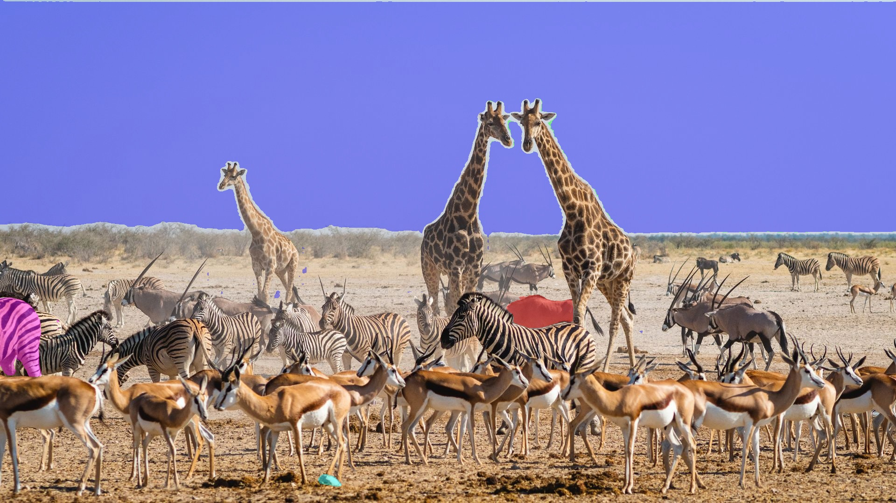

# 06 · SAM2 baseline (25 Aug 2025)

The last experiment before the project was shelved. After the investor search
of June/July 2025 the question was whether a prompt-based foundation model
(Meta's **Segment Anything 2**) could replace the trained detector: a few
clicks per match instead of a labelled dataset, with SAM2's own memory doing
the tracking.

| File | What it does |
|------|--------------|
| `run_test.py` + `config.yaml` | SAM2 image predictor on one frame. Prompt type `auto` (everything), `point` or `box` from the config; writes an overlay image. |
| `run_video_track.py` + `config_video.yaml` | SAM2 video predictor: frames are extracted to a folder, a fixed grid of ten points (top row, sides, bottom row of the frame) is used as positive prompts on frame 0, objects whose mask covers 0.1–8 % of the frame are kept, masks are propagated through the clip and drawn as coloured overlays into an output video. |
| `run_billboard_track.py` | Same tracker with the area window widened to 0.5–15 % of the frame so that boards, not players, survive the filter. |

 
Output of <code>run_test.py</code> in automatic mode on the stock test photo used for the smoke test: sky, one zebra, one antelope and a small object came back as separate masks. The football clips were only used with the video predictor.

## What came out

* SAM2 (hiera-small, bfloat16) tracks whatever it is prompted with very well
  through a 15-second clip on the GPU.
* Without a board-specific prompt strategy it segments everything: the grid
  prompts land on crowd, pitch and players as often as on boards. Choosing
  the points automatically is the same problem the trained detector solves.
* The promising combination, a detector (or a few user clicks) to *prompt*
  and SAM2 to *track*, was not built; the project stopped here.

## Running

Clone https://github.com/facebookresearch/sam2 into `sam2/` next to these
scripts, download `sam2.1_hiera_small.pt` into `sam2/checkpoints/`, put a
clip at `data/1.mp4` (see `docs/assets.md`) and run
`python run_video_track.py`. Requires PyTorch with CUDA.
