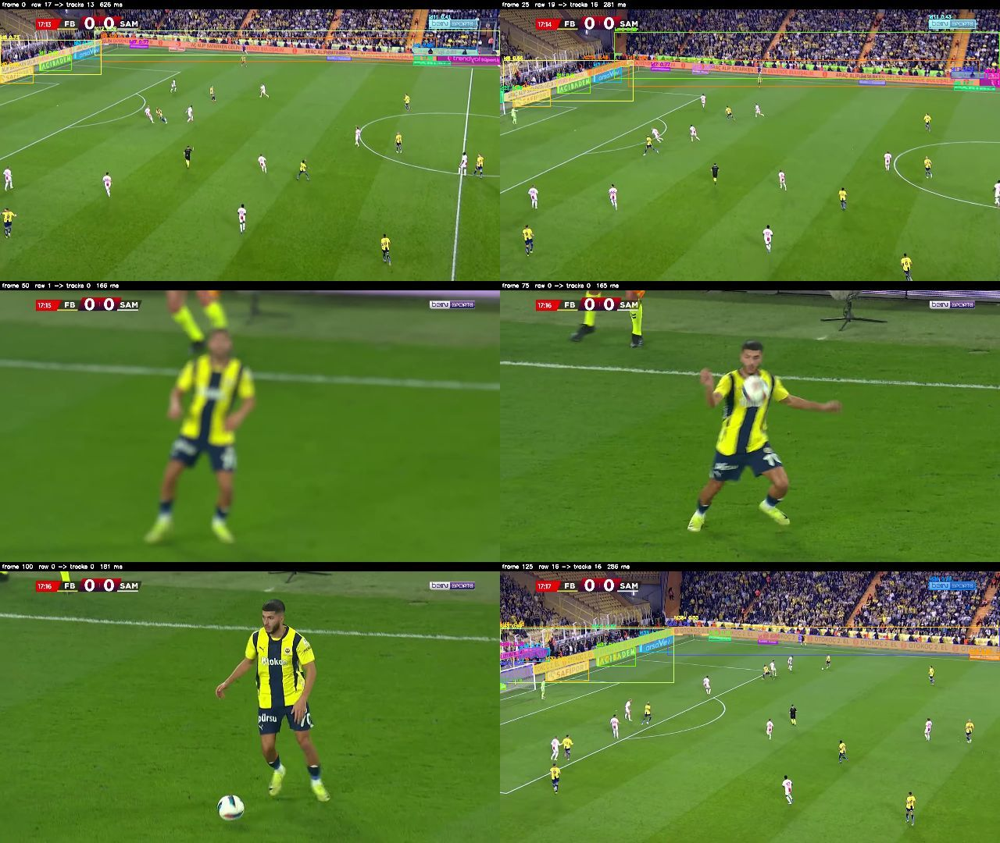

# 07 · SAM3 for board detection and tracking (Sep 2026)

Goal of this chapter: replace per-frame Mask R-CNN detection with a
prompt-based foundation model. Plain Python scripts with paths at the top of
each file, no web app, no Docker. When something works here it moves into
`app/`.

Plan, one step at a time:

1. **Environment** — venv with PyTorch (CUDA 12.8) and the `sam3` package (this page).
2. **Does SAM3 find the boards?** — `sam3_image_probe.py`: text prompts on
   sampled frames of the three clips, overlays + contact sheets, tune the
   prompt and the confidence threshold.
3. **Tracking** — SAM3 video predictor: prompt once, propagate through the
   clip, stable ids, no per-frame detection.
4. **Replacement** — board-space rendering on top of the tracked masks
   (an ad half visible when the board is half visible), then occluders.

## 1. Environment (Windows, local venv outside OneDrive)

SAM3 needs Python 3.12+ and PyTorch 2.7+ with CUDA 12.6+. The venv lives in
`C:\Users\<you>\venvs\adswapai` so that OneDrive does not sync gigabytes of
packages.

```powershell
python -m venv C:\Users\$env:USERNAME\venvs\adswapai
C:\Users\$env:USERNAME\venvs\adswapai\Scripts\python.exe -m pip install --upgrade pip
C:\Users\$env:USERNAME\venvs\adswapai\Scripts\python.exe -m pip install torch torchvision --index-url https://download.pytorch.org/whl/cu128
C:\Users\$env:USERNAME\venvs\adswapai\Scripts\python.exe -m pip install "git+https://github.com/facebookresearch/sam3.git" "huggingface_hub[cli]"
C:\Users\$env:USERNAME\venvs\adswapai\Scripts\python.exe -m pip install einops pycocotools psutil triton-windows "numpy<2" "opencv-python-headless<5" pillow
C:\Users\$env:USERNAME\venvs\adswapai\Scripts\python.exe -m pip install torchao kornia   # torchao: fp8 backbone (FP8 = True); kornia: installed, not used yet
```

ffmpeg with NVENC must be on PATH for the H.264 output (`ENCODER = "nvenc"`;
falls back to OpenCV mp4v without it).

Notes from the first install on Windows (Sep 2026):

* `sam3` imports `einops`, `pycocotools`, `psutil` and `triton` at package
  import time without declaring them. Triton has no official Windows build;
  the community `triton-windows` wheel (3.8) imports fine. Its kernels are
  compiled at first use and need the MSVC Build Tools (VS 2022) installed.
* `sam3` pins `numpy<2`, so OpenCV must stay on a 4.x wheel (OpenCV 5 pulls
  numpy 2).
* `pip install` of the git URL takes several minutes (clone + timm).

Checkpoints are gated on Hugging Face (SAM License):

1. Open https://huggingface.co/facebook/sam3 and accept the terms.
2. Create a read token at https://huggingface.co/settings/tokens.
3. Log in once from your terminal (the token is stored in your user profile):
   `C:\Users\$env:USERNAME\venvs\adswapai\Scripts\hf.exe auth login`

Check everything (add `--download` to fetch the 3.4 GB checkpoint right away):

```powershell
cd experiments\07_sam3_sep2026
C:\Users\$env:USERNAME\venvs\adswapai\Scripts\python.exe check_env.py --download
```

Put the sample clips in `data/` (`1.mp4`, `2.mp4`, `3.mp4`, see `docs/assets.md`).

## 2. Image probe

```powershell
C:\Users\$env:USERNAME\venvs\adswapai\Scripts\python.exe sam3_image_probe.py
```

Look at `output/image_probe/<clip>_sheet.jpg` (rows = timestamps, columns =
prompts) and `summary.json`. Things to play with at the top of the script:
`PROMPTS`, `CONFIDENCE` (SAM3 default 0.5), `TIMESTAMPS`. What we want to
see before moving on: every visible board found, the far LED strip included,
no crowd/pitch/player false positives, stable scores across the four
timestamps.

### Findings (2 Sep 2026, 11 frames from the 3 clips, RTX 5070 Ti)

* Speed: backbone about 140 ms per 1080p frame at 1008 px, each extra text
  prompt about 55 ms. Model load 6 s, weights 3.4 GB, bf16 autocast needed.
* Prompt matters more than anything else. `sam3_prompt_sweep.py` ranking
  (frames with at least one hit / mean score at threshold 0.2):

  | prompt | hit frames | mean score | remarks |
  |--------|-----------|------------|---------|
  | sponsor banner | 11/11 | 0.46 | every board incl. far LED strips, some crowd flags |
  | advertisement | 11/11 | 0.43 | same coverage |
  | banner | 11/11 | 0.44 | slightly fewer boards |
  | advertising banner | 11/11 | 0.39 | misses far strips |
  | billboard | 9/11 | 0.30 | first choice, weak: misses wide shots |
  | LED perimeter board, perimeter advertising, advertising hoarding | 0/11 | - | nothing |

* Threshold: with "sponsor banner" the number of detections per frame is
  about 40 at 0.2, 27 at 0.3, 20 at 0.4, 15 at 0.5 (min 10). No mask larger
  than 8 % of the frame: the huge boxes in the overlays are the bounding boxes
  of long slanted strips, not crowd masks.
* The zoom crop (upper 5-60 % band) did not add recall; not needed.

<p align="center"><br>
<sub>"sponsor banner", threshold 0.2: rows = clips 1/2/3, columns = 1/4/8/11 s. Every board is found, including the far LED strips in the wide shots.</sub></p>
* Remaining precision problems: overlapping duplicates (a board found as a
  whole and as its sponsor panels), the broadcaster score bug, crowd flags.
  Plan: threshold 0.3-0.4, mask-IoU de-duplication, a HUD exclusion zone.

## 3. Video tracking probe

```powershell
C:\Users\$env:USERNAME\venvs\adswapai\Scripts\python.exe sam3_video_probe.py
```

One text prompt on `START_FRAME`, then SAM3's video predictor propagates the
masks (`MAX_FRAMES` frames, forward). Output in `output/video_probe/`: a
diagnostic video (one colour per object id, id + probability, ms per frame),
a contact sheet and a stats JSON (unique ids, frames per id, fps). What we
want to see: each board keeps one id for the whole clip, ids do not swap or
multiply, masks stay tight when players pass in front, and a usable fps.

### Findings (clip 2, 150 frames, "sponsor banner", threshold 0.3, SAM3 video predictor)

* Clip 2 contains a camera cut at about frame 45 (close-up of a player until
  frame ~120, then back to the wide shot). The tracker correctly holds 11
  boards before the cut, tracks nothing during the close-up and re-detects
  the boards after it, re-using most of the old ids (ids 1, 3, 5-9 appear in
  both wide segments). Any pipeline needs a shot-cut detector anyway.
* One persistent false object: the broadcaster's top band (id 4, present in
  136 of 151 frames). A HUD exclusion zone fixes it.
* Speed is the problem: 0.24 fps overall. Median 0.9 s per frame, but the
  periodic re-detection frames take 10-60 s (p90 = 10.8 s) and VRAM peaks at
  15 GB with `offload_video_to_cpu=True`. The image model finds the same
  boards in 140 ms per frame.
* Next: the SAM 3.1 "multiplex" predictor (built for many objects), then, if
  still too slow, a hybrid: SAM3 image detection every frame + our own
  IoU/Kalman association.

### Hybrid tracker (`sam3_hybrid_track.py`, same clip and frames)

SAM3 image model on every frame + mask de-duplication (IoU > 0.6 or 80 %
containment), HUD exclusion (top 8 %), IoU association with a 5-frame hold,
histogram-based shot-cut detection.

| | SAM3 video predictor | hybrid |
|---|---|---|
| speed | 0.24 fps, spikes of 10-60 s | 3.4 fps, median 251 ms, no spikes |
| shot cut | survives it, re-uses most ids | detected at frames 46 and 112 (correct), ids reset |
| close-up segment | one persistent false object (top band) | 0 objects |
| id stability | 11 ids stable in the first segment | 9 boards stable for all 46 frames, but 56 ids in total: some panels flicker between "whole board" and "single sponsor panel" detections and spawn short-lived ids |

Speed favours the hybrid, mask/id consistency favours the video predictor.

<p align="center"><br>
<sub>Hybrid tracker on clip 2: frames 0, 25 (wide shot, 13-16 tracks), 50-100 (close-up after the cut, nothing), 125 (back to the wide shot, new ids).</sub></p>

### SAM 3.1 multiplex predictor (`VERSION = "sam3.1"`)

Two Windows-specific problems had to be worked around in `sam3_video_probe.py`:
the base predictor passes `offload_state_to_cpu` to the 3.1 model's
`init_state`, which rejects it (wrapped to drop the argument), and the 3.1
decoder pins scaled-dot-product attention to the flash kernel, which raises
"No available kernel" on this torch/Blackwell build (`sdpa_kernel` is
replaced by a permissive one). With that, the text prompt on frame 0 took
**0.85 s for 9 objects** (SAM3: 8.6 s), but the propagation then died
silently (no Python traceback, VRAM at 15.8 GB). Not measured yet; retry
with `max_num_objects` lowered and the video offloaded to CPU.

### Where we are (end of 2 Sep 2026)

* Detection: solved by prompt choice ("sponsor banner" / "advertisement",
  threshold 0.3-0.4), sharp masks, ~200 ms per frame.
* Tracking: the architecture is "detect on the first frame and on events
  (shot cut, new object), track in between". What fills the gap between
  detections is open: SAM 3.1 (quality, if it runs in 16 GB) or our own
  propagation (camera-motion homography + IoU association, fast). The
  homography is needed for step 4 anyway.
* Step 4 (board-space replacement) starts once the tracker choice is made.

### Speed: where the time goes (`sam3_speed_probe.py`, 3 Sep 2026)

Same clip, prompt and thresholds as the hybrid tracker (clip 2, 150 frames,
"sponsor banner", 0.35). Every stage is timed with the CUDA stream synchronised;
the first 3 frames are warm-up and not counted.

| variant | fps | ms/frame | backbone | decoder | CPU side* | ids |
|---|---|---|---|---|---|---|
| baseline (hybrid tracker as written) | 3.3 | 300 | 107 | 62 | 128 | 56 |
| fast: cached text embedding, de-dup + IoU tracking on the GPU at decoder mask resolution, only surviving masks up-sampled, overlay blended on the GPU | 6.1 | 165 | 100 | 51 | 14 | 60 |
| fast + torch.compile (encoder/decoder) | 6.5 | 153 | 94 | 45 | 13 | 61 |
| fast + SAM3 on every 2nd frame, tracks held in between | 11.4 | 88 | 49 | 24 | 14 | 96 |
| fast + input 768 / 640 px | fails | | | | | |

\* copy to CPU + de-duplication + tracking + drawing + encoding. Detections
are identical in all runs (9.4 raw -> 7.0 kept per frame).

* Ported into `sam3_hybrid_track.py` the same day: everything after the model runs
  on the GPU, the video is encoded on NVENC through ffmpeg (`ENCODER`), the
  backbone runs with cuDNN attention first (`ATTENTION`; flash SDPA is not
  available on sm_120, the default "efficient" kernel is 2x slower per global
  block, but it only buys ~1 ms per frame). Clip 2, 150 frames: 6.3 fps, 158 ms
  per frame (backbone 99, decoder 50, everything else 9), same shot cuts, 59 ids.
  Still on the CPU: cv2 decoding 2 ms, shot-cut histogram 0.4 ms, box/text drawing.
* In the original loop 43 % of the time was Python/numpy work on full-resolution
  masks (to_cpu 13 ms, dedupe 23, track 32, draw 54). Doing it on the GPU at the
  decoder's mask resolution removes almost all of it: 3.3 -> 6.1 fps with the
  same detections. This is the change to port into `sam3_hybrid_track.py`.
* After that the model is 91 % of the frame: backbone ~100 ms, decoder ~50 ms.
  torch.compile gains 8 % for ~40 s of compilation at every start (Triton on
  Windows works); marginal.
* Detecting every 2nd frame doubles the fps, but ids fragment (96 instead of 60):
  a held mask does not follow the camera pan, so the IoU match fails on the next
  detection. Skipping frames only makes sense together with mask propagation
  (camera homography or optical flow), which step 4 needs anyway; with it,
  detection every 3-5 frames is realistic (15-20+ fps).
* A lower input resolution is not a switch: the ViT builder hard-codes
  `img_size=1008` and RoPE frequencies are precomputed for the 72x72 token grid,
  so `Sam3Processor(resolution=768)` fails an assertion. `use_interp_rope=True`
  suggests a rebuild at another multiple of 14 x 24 = 336 px (672) would run;
  untested, and the thin far strips may not survive it.

### GPU utilisation: filling the card (`sam3_gpu_util_probe.py`, 3 Sep 2026)

After the port the model was 94 % of the frame, so the question became how
busy the GPU is inside the model. torch.profiler on the fp32-weights +
autocast version (clip 2, wide shot):

* backbone: 95 ms wall, 95 ms of kernels: GPU-bound. Its GEMMs (59 ms) run
  within 10 % of cuBLAS speed for the same shapes (52.8 ms), and the card
  tops out at about 85 TFLOPS bf16, so the backbone is at the bf16 ceiling.
  Batching 2-4 frames gains 6 %.
* decoder: 48 ms wall for 21 ms of kernels. About 2 900 kernel launches per
  frame (1 000 of them autocast weight casts): launch-bound.
* nvidia-smi (1 s samples) during the 150-frame loop: 82 % mean utilisation,
  swinging 67-95 %, 191 W of 300 W.

What fixed it (all in `sam3_hybrid_track.py`, each a setting at the top):

| step | backbone | decoder | frame | fps |
|---|---|---|---|---|
| GPU post-processing (previous section) | 99 | 50 | 158 | 6.3 |
| + bf16 backbone weights (`BF16_WEIGHTS`) | 91 | 50 | 148 | 6.8 |
| + transformer encoder/decoder under `torch.compile(mode="reduce-overhead")` = CUDA graphs (`COMPILE_DECODER`) | 91 | 25 | 118 | 8.5 |
| + ViT compiled at build (`COMPILE_BACKBONE`), reader/writer threads (`PIPELINE_THREADS`) | 86 | 22 | 114 | 8.8 |

Detections and ids unchanged in every step (17 boards on frame 0, mean score
0.658; 59 ids, cuts at 46 and 112). The decoder now takes exactly its GPU
time, the CPU stages hide behind the GPU (decode 0.2 ms, encode 0 ms on the
main thread) and the frame is 95 % model kernels. nvidia-smi during the loop:
91 % mean, steady 87-94 %, 209 W. First start pays ~25 s of
compilation (Inductor caches it; later starts are faster).

Notes:
* A manual `torch.cuda.CUDAGraph` around `forward_grounding` does not work:
  the encoder builds `spatial_shapes` from a Python list (CPU->GPU copy) and
  the decoder's coordinate cache does an operation that is illegal during
  capture. `reduce-overhead` handles both.
* `model.to(bfloat16)` breaks the model: RoPE keeps complex buffers (cast to
  real) and the grounding decoder runs parts in fp32 on purpose. Convert only
  `model.backbone`, float tensors only (`to_bf16`).
* Flash SDPA is unavailable on sm_120 in torch 2.11; cuDNN attention is 2x
  faster than the default "efficient" kernel per global block, but attention
  is only ~20 ms of the backbone, so it buys ~1 ms.

What is left, in order of expected gain:
1. fp8 for the ViT linear layers: `torch._scaled_mm` measures 181 TFLOPS vs
   85 bf16 on this card, so the 55 ms of GEMMs could drop to ~30 ms. Needs
   torchao (float8 dynamic quantisation) and a detection-parity check.
2. Rebuild the ViT at 672 px (2.2x fewer tokens): -40 ms if the far strips
   survive it.
3. Detect every N frames with mask propagation between detections.

### fp8 backbone (`sam3_fp8_probe.py`, torchao 0.18, 3 Sep 2026)

torchao's `Float8DynamicActivationFloat8WeightConfig` (weights fp8 once,
activations fp8 per call with a dynamic per-tensor scale) on the 128 Linear
layers of the ViT trunk. Clip 2, frames 0-29, parity against the bf16 model
on all 200 queries per frame:

| backbone | ms | kept/frame | mask IoU vs bf16 | kept-set agreement |
|---|---|---|---|---|
| bf16 eager | 90.6 | 17.4 | 1 | 1 |
| bf16 compiled | 90.1 | 17.4 | 0.995 | 0.996 |
| fp8 eager | 131.1 | 17.0 | 0.960 | 0.980 |
| fp8 compiled | 59.4 | 17.0 | 0.966 | 0.984 |

Full clip with `FP8 = True` in `sam3_hybrid_track.py`: **11.1 fps**, 87 ms
per frame (backbone 61, decoder 23), same shot cuts, 7.00 kept boards per
frame (bf16: 7.01), 26 ids living 20+ frames in both runs; 5 more short-lived
ids (64 vs 59) and the kept count differs by one in 33 of 150 frames. The
contact sheets are indistinguishable (`output/fp8/sheet_bf16.jpg`,
`sheet_fp8.jpg`). Verdict: keep it on; masks are ~3 % looser than bf16, which
the tracker absorbs, but re-check once the replacement rendering exists.

Three things had to be worked around:
* eager fp8 is slower than bf16 (tensor-subclass dispatch + scaling kernels
  per layer); torch.compile fuses them, so `FP8` requires `COMPILE_BACKBONE`;
* the ViT MLP calls `aten._addmm_activation` on fc1's raw weight (fused
  linear + GELU), which bypasses the module and has no Float8 kernel:
  `patch_fused_mlp` routes fp8 layers through `linear` + GELU;
* torchao tensors do not work under `torch.inference_mode` (use `no_grad`),
  autocast leaves LayerNorm output in fp32 so the fp8 linears get a bf16
  pre-hook, and row-wise scaling (`PerRow`) is not supported by
  `torch._scaled_mm` on sm_120 in torch 2.11: per-tensor only.

Speed history on clip 2, 150 frames: 3.3 fps (2 Sep) -> 6.3 (GPU
post-processing) -> 8.8 (bf16 weights, CUDA graphs, threads) -> 11.1 (fp8).

### Camera-motion propagation (3 Sep 2026)

Detect on every N-th frame, move the tracks with the camera in between. Per
frame: RAFT-small optical flow (torchvision) at 480x272 on the GPU, under
torch.compile "reduce-overhead" (15 -> 2.5 ms); one correspondence every 8
flow pixels (2 040 points); homography fitted with `cv2.findHomography`
RANSAC (~1.5 ms); every track's full-resolution mask warped on the GPU with
`grid_sample` (nearest, ~2 ms for 16 masks), its low-resolution IoU vector and
box recomputed from the warped mask. Shot cuts still force a detection and a
tracker reset. Clip 2, 150 frames, fp8 backbone:

| config | fps | ms/frame | unique ids | ids alive 20+ frames | tracks/frame | match IoU* |
|---|---|---|---|---|---|---|
| detect every frame, no propagation | 11.1 | 89 | 64 | 26 | 8.5 | 0.78 |
| every 3rd frame, tracks frozen | 27.3 | 36 | 113 | 36 | 15.2 | 0.64 |
| every 3rd frame + homography | 24.2 | 41 | 36 | 29 | 8.0 | 0.84 |
| every frame + homography | 10.4 | 96 | 53 | 28 | 8.3 | 0.89 |
| every 5th frame + homography | 33.1 | 30 | 38 | 34 | 8.5 | 0.81 |

\* mean IoU between a track and the detection it is matched to on detection
frames: how well the propagated mask lands on the board. Homography inlier
ratio 0.95, 2 failures in 150 frames (the two shot cuts).

* Freezing tracks between detections is worse than useless: 113 ids and 15
  tracks per frame, because a frozen board and its re-detection coexist as
  two tracks. Moving them with the camera fixes it: 36 ids, fewer than
  detecting every frame (64), and the matches are tighter (0.84 vs 0.78).
* Every 5th frame runs at 33 fps, real time for 30 fps footage, with 38 ids.
  Default is every 3rd (24 fps, 100 ms detection latency for a board entering
  the frame); `DETECT_EVERY = 5` when speed matters more.
* kornia 0.8.3 was installed for this step but is not on the path: its RANSAC
  takes 13 ms for 2 000 points (Python loop), its batched DLT with iterative
  trimming is fast enough (5 ms) but collapses above ~40 % outliers, and
  `warp_perspective` on 16 full-resolution masks takes 14 ms (a shared
  `grid_sample` grid does it in 2 ms). It may still be handy for the
  replacement rendering (perspective transforms of small textures).
* Contact sheet: `output/propagation/every3_raft/2_sponsor_banner_hybrid_sheet.jpg`;
  propagated frames are marked "propagated" in the status bar and "~" on ids.

Speed history on clip 2: 3.3 fps (2 Sep) -> 6.3 (GPU post-processing) -> 8.8
(bf16, CUDA graphs, threads) -> 11.1 (fp8) -> 24 / 33 (detect every 3rd / 5th
frame + propagation).

## 4. Replacement (`sam3_replace.py`, 3 Sep 2026)

First end-to-end output: every tracked board carries a real ad, no boxes, no
labels, source audio copied. Per track and frame: the mask's quadrilateral
(minimum-area rectangle, long edges as top/bottom, corners snapped to the
convex hull) is fitted once per detection and moved with the camera
homography on propagated frames; the ad is mapped into it on the GPU (inverse
homography per pixel of the board's box, bilinear sampling), repeated with
its aspect ratio on wide strips and centre-cropped on narrow boards, and
painted where the mask is set with a 1 px inward feather. Players in front of
a board are not in SAM3's mask, so they stay in front of the ad.

Clip 2 (283 frames, 1080p, 30 fps source), `bilboardsArtboard4.jpg`
(1093x128, an 8.5:1 LED strip banner), fp8 backbone:

| detect every | fps | ms/frame | render ms | boards/frame | ids | match IoU |
|---|---|---|---|---|---|---|
| 3 | 19.4 | 51 | 10.9 | 11.7 | 53 | 0.84 |
| 5 | 26.4 | 38 | 9.8 | 11.3 | 47 | 0.81 |

Output: `output/replace/every5/2_bilboardsArtboard4.mp4` and a contact sheet
of original | replaced pairs next to it.

Same settings on the other two clips (detect every 5th frame):

| clip | frames | fps | boards/frame | ids | match IoU | homography failures |
|---|---|---|---|---|---|---|
| 1 (goal-end camera, boards behind the goal) | 430 | 24.4 | 13.5 | 46 | 0.84 | 1 |
| 2 (wide shot, close-up, wide shot) | 283 | 26.4 | 11.3 | 47 | 0.81 | 2 |
| 3 (two tiers of LED boards, many small panels) | 610 | 23.5 | 14.3 | 135 | 0.83 | 2 |

Clip 3's 135 ids are the far-side "ARKHAM" panels found one by one, so the
ad appears panel by panel there (the per-panel limit below). Outputs in
`output/replace/clip1/` and `output/replace/clip3/`.

* Found and fixed on the first output: the broadcaster logo top-right (beIN)
  sits below the 8 % HUD band and was replaced with the ad. `HUD_CORNER`
  drops masks confined to the top-right corner (x >= 78 %, y <= 16 %).
* Fitting the quad from the mask on every frame cost 14 ms; fitting it on
  detection frames only and warping its corners with H on the others costs
  11 ms and removes the frame-to-frame jitter of the ad.
* Known limits of this first version: a board found as separate sponsor
  panels gets the ad once per panel; on propagated frames an occluding player
  keeps the hole from the last detection (moves with the camera, not with the
  player); no lighting / colour matching of the ad; thin far strips get the
  banner at a few pixels height.

## Access

The checkpoint repo is gated *with manual approval*: after accepting the terms
the request shows "awaiting a review from the repo authors" until Meta
approves it. `check_env.py` reports a 403 until then.
